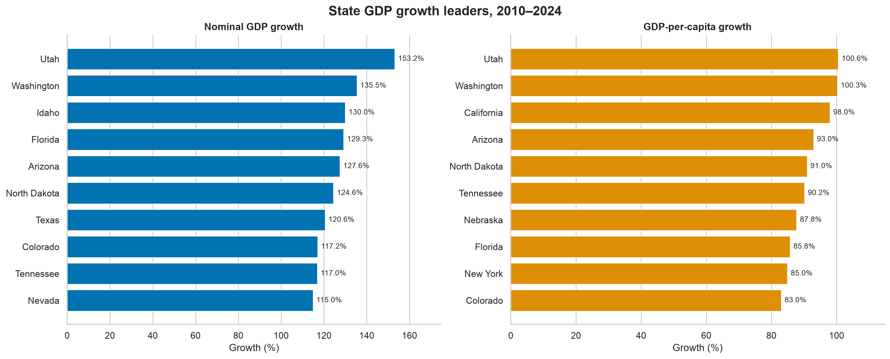
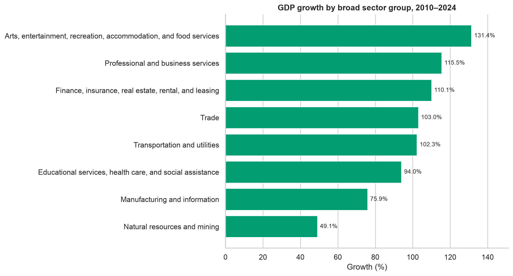
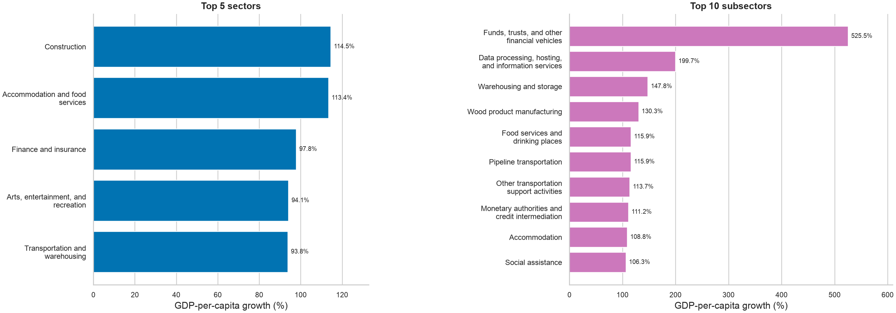
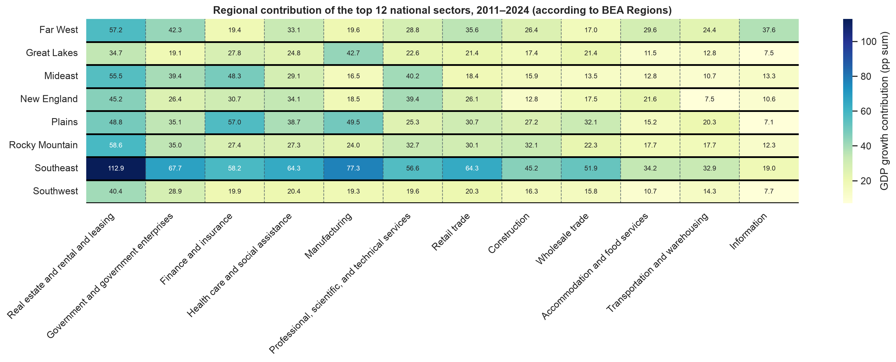
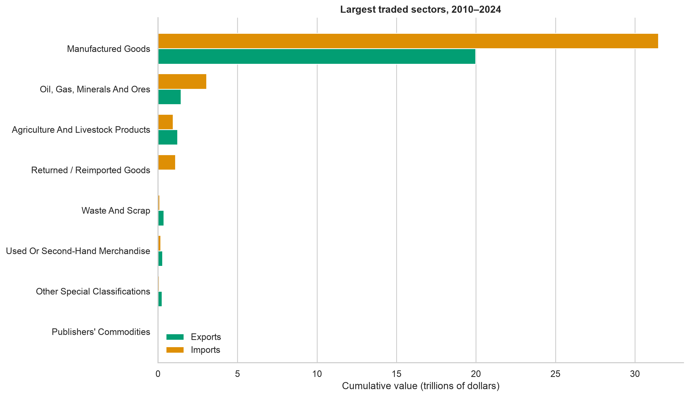
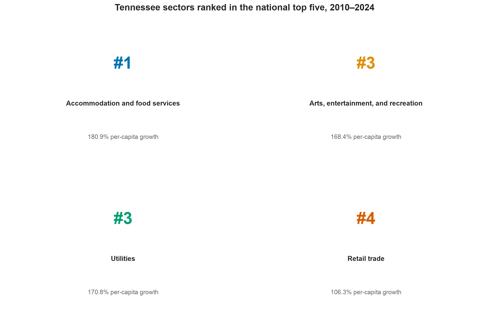
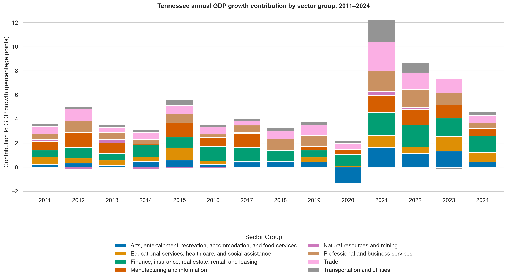

## Study scope

:::: {.columns .scope-layout}
::: {.column .scope-main width="58%"}

### Motivation

Nashville experienced significant growth in the years following the pandemic. 

Witnessing this raises the question whether our experience was unique, or whether this growth was reflected nationally.

### Questions

Which states sustained the strongest economic growth?

Which industries drove the change? How does international trade shape the picture? 

::: 

::: {.column .scope-sidebar width="34%"}

  Study period
  2010–2024

### Data sources

**Bureau of Economic Analysis**  
*GDP by State and NAICS*

**U.S. Census Bureau**  
*International Trade Data by State and NAICS*

:::
:::: 

## Exploring the data

:::: {.columns .explore-layout}
::: {.column .naics-column width="46%"}

### Broad Sector Groups

#### Production & Goods Sectors
- 11 & 21 - Natural Resources and Mining
- 31-33 & 51 - Manufacturing & Information
- 22 & 48-49 - Infrastructure & Logistics

#### Commerce & Asset Management
- 42 & 44-45 - Wholesale & Retail Trade
- 52 & 53 - FIRE

#### Professional & Social Services
- 54-56 - Corporate & Professional Services
- 61 & 62 - Education & Healthcare
- 71 & 72 - Leisure & Hospitality

:::

::: {.column .metric-column width="48%"}

### Measures

  
<strong>Nominal GDP</strong> Economic output in current dollars

  
<strong>GDP per capita</strong> Output adjusted for population

### Growth Contribution

$$
\text{Growth contribution}_{i,t} = \text{GDP share}_{i,t-1} \times \text{Industry growth rate}_{i,t}
$$

This metric estimates how much each industry adds to annual GDP growth.

### NAICS industry hierarchy

  
2-digit<strong>Sector</strong><small>Broad industry group</small>

  
3-digit<strong>Subsector</strong>

  
4-digit<strong>Industry group</strong>

  
5-digit<strong>NAICS industry</strong>

  
6-digit<strong>National industry</strong><small>Most detailed classification</small>

:::
::::

## Utah led both state growth rankings

{.chart-wide fig-alt="Two horizontal bar charts ranking state nominal GDP growth and GDP-per-capita growth from 2010 to 2024. Utah ranks first in both."}

::: {.slide-takeaway}
Utah grew **153.2%** in nominal GDP and **100.6%** per capita. Tennessee ranked in the top ten on both measures.
:::

::: {.notes}
The ranking changes when population is considered, but Utah remains first. Washington ranks second in both measures. Tennessee ranks ninth in nominal growth and sixth in per-capita growth.
:::

## Leisure and hospitality led broad sector group growth

{.chart-wide fig-alt="Horizontal bar chart ranking broad sector groups by nominal GDP growth from 2010 to 2024."}

::: {.slide-takeaway}
Arts, entertainment, recreation, accommodation, and food services grew **131.4%**. Professional and business services ranked second at **115.5%**.
:::

## Sectors and subsectors reveal broader trends

{.sector-subsector fig-alt="Side-by-side horizontal bar charts showing the five fastest-growing sectors and ten fastest-growing subsectors by GDP per capita from 2010 to 2024."}

::: {.slide-takeaway}
Construction (**114.5%**) and accommodation and food services (**113.4%**) led sectors. Funds, trusts, and other financial vehicles led subsectors at **525.5%**.
:::

## Growth drivers differ by region

{.heatmap fig-alt="Heatmap comparing the cumulative contribution of twelve leading sectors across eight BEA regions from 2011 to 2024."}

::: {.slide-takeaway}
Real estate contributes strongly across regions, while manufacturing carries more weight in the Great Lakes, Plains, and Southeast.
:::

## Manufactured goods dominate international trade

{.chart-wide fig-alt="Horizontal grouped bar chart showing cumulative export and import values by sector from 2010 to 2024. Manufactured goods are far larger than other categories."}

::: {.slide-takeaway}
Manufactured goods accounted for about **$20.0 trillion in exports** and **$31.5 trillion in imports** during the period.
:::

## Tennessee’s sector strengths

{.tn-ranks fig-alt="Four indicators showing Tennessee's national rank and per-capita growth in accommodation and food services, arts and recreation, utilities, and retail trade."}

::: {.notes}
Tennessee ranked first nationally in accommodation and food services growth. It ranked third in arts, entertainment, and recreation and utilities, and fourth in retail trade. These rankings use GDP-per-capita growth from 2010 to 2024.
:::

## Tennessee’s growth shifted after 2020

{.timeline fig-alt="Stacked bar chart showing annual sector-group contributions to Tennessee GDP growth from 2011 to 2024."}

::: {.slide-takeaway}
Finance, insurance, real estate, rental, and leasing became Tennessee’s most consistent post-2020 contributor. Leisure-related activity also rebounded sharply.
:::

## Explore the results

The interactive dashboard lets you compare economic change by state, industry, and year.

::: {.dashboard-link}
[Open the Tableau dashboard](https://public.tableau.com/views/dashboard_final_17895298449870/Overview?:showVizHome=no)
:::

## Project challenges

01

<h3>Code mapping</h3>

To compare the two datasets, the codes were often grouped or stored differently which led to the need for code mapping (both BEA and census data were more inconsistent as the level of detail increased).

02

<h3>NAICS levels of detail</h3>

Charts and filters had to preserve the selected level of detail. If they weren't included in the filter context, the aggregations would sum totals across hierarchies.

03

<h3>Measuring impact vs. overall growth</h3>

Initially the comparisons were solely with nominal GDP and GDP-per-capita values, but this didn't reflect the regional impact of each industry.

## Lessons Learned

<article class="lesson-item">

<h3>Test Assumptions</h3>

The size and breadth of the data meant that each calculation needed to consider the assumptions used to frame the question and interpret the results.

</article>
<article class="lesson-item">

<h3>Validating Results</h3>

Tableau can aggregate large datasets quickly, but every visualization still needs validation. Confirm that filters and calculated measures use the intended context and level of detail.

</article>
<article class="lesson-item">

<h3>Reframing the Question</h3>

Viewing the same data through another context can reveal questions and patterns that the original analysis may miss.

</article>

